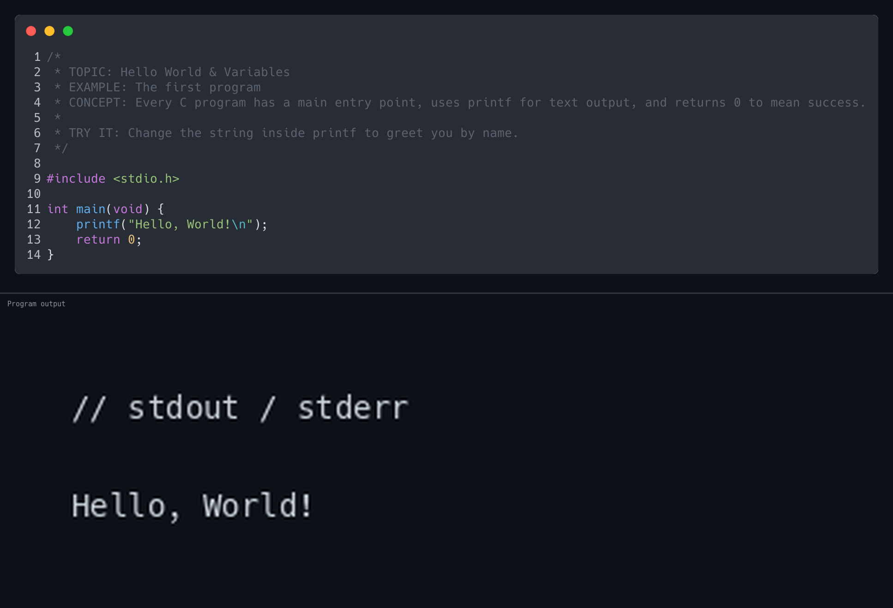
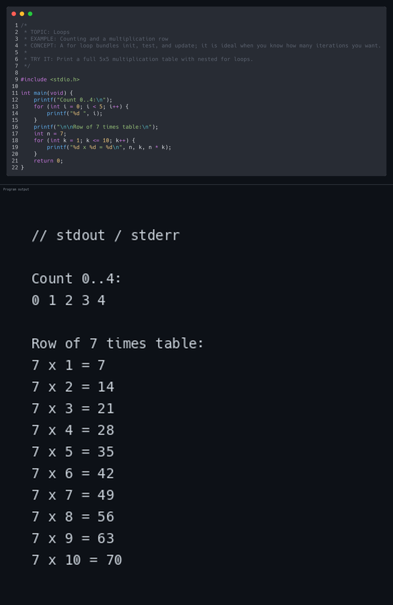
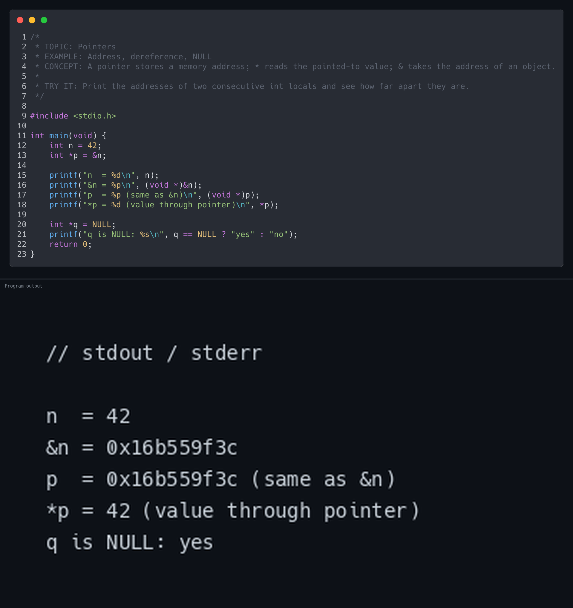

# C Learning Library

```
   ██████╗     ██╗     ███████╗ █████╗ ██████╗ ███╗   ██╗██╗███╗   ██╗ ██████╗ 
  ██╔════╝     ██║     ██╔════╝██╔══██╗██╔══██╗████╗  ██║██║████╗  ██║██╔════╝ 
  ██║          ██║     █████╗  ███████║██████╔╝██╔██╗ ██║██║██╔██╗ ██║██║  ███╗
  ██║          ██║     ██╔══╝  ██╔══██║██╔══██╗██║╚██╗██║██║██║╚██╗██║██║   ██║
  ╚██████╗     ███████╗███████╗██║  ██║██║  ██║██║ ╚████║██║██║ ╚████║╚██████╔╝
   ╚═════╝     ╚══════╝╚══════╝╚═╝  ╚═╝╚═╝  ╚═╝╚═╝  ╚═══╝╚═╝╚═╝  ╚═══╝ ╚═════╝ 
```

<div align="center">

**A hands-on C programming library built for absolute beginners.**

Learn C from *hello world* to *structs*

**macOS** · **Linux** · **Windows (WSL/MSYS2)**

[](LICENSE)


[](https://github.com/chama-x/C-Learning-Library/actions/workflows/ci.yml)
[](https://c-practice-2.vercel.app/)

</div>

---

## ⚡ Quick Start

Run these in Terminal or Command Prompt one by one!

```bash
git clone https://github.com/chama-x/C-Learning-Library.git
cd C-Learning-Library
chmod +x setup.sh && ./setup.sh   # checks gcc, make & optional tools
make run-all                      # runs every example in order
```

Run a **single** example:

```bash
make run TOPIC=01_hello_world/hello_world
```

| Command | What it does |
|---------|-------------|
| `make all` | Build everything into `bin/` |
| `make run TOPIC=...` | Build & run one example |
| `make run-all` | Tour all examples in order |
| `make preview` | Generate `preview_*.png` (code + output) |
| `make clean` | Delete `bin/` |

---

## 🌐 Web playground (Vercel)

Run the same examples in the browser (edit, **Run**, optional live JSCPP + baked `gcc` output):

**Live app:** [https://c-practice-2.vercel.app/](https://c-practice-2.vercel.app/) (root serves `playground.html` via `vercel.json`)

**Deploy updates** (with [Vercel CLI](https://vercel.com/docs/cli) logged in): from the repo root, `vercel deploy --prod` (use `--scope <team>` if your account requires it). `vercel.json` + `playground.html` + `topics/` are all that’s needed for hosting.

**What CI checks on every push / PR**

| Check | Meaning |
|--------|--------|
| `make all` | Every `.c` example compiles with `gcc -Wall -Wextra -std=c11 -pedantic` on Ubuntu |
| `scripts/verify_playground_manifest.py` | Each `MANIFEST` path exists on disk and matches `BAKED` keys in `playground.html` |
| `playground.html` size | File is present and non-trivial (catch truncated uploads) |

*Fork? Replace repo links and redeploy under your own Vercel project.*

---

## 🖥️ Prerequisites

| OS | Install |
|----|---------|
| **macOS** | `xcode-select --install` |
| **Debian / Ubuntu** | `sudo apt install build-essential` |
| **Fedora** | `sudo dnf groupinstall "Development Tools"` |
| **Windows** | [WSL](https://learn.microsoft.com/en-us/windows/wsl/install) or [MSYS2](https://www.msys2.org/) |

> **Optional:** [silicon](https://github.com/Aloxaf/silicon) for syntax-highlighted code images. `make preview` auto-creates `scripts/.venv/` with **Pillow** if needed.

---

## 📚 Chapters

| # | Topic | What you'll learn |
|---|-------|-------------------|
| 01 | **Hello World & Variables** | `printf`, data types, your first program |
| 02 | **Operators** | Arithmetic, relational, logical |
| 03 | **Control Flow** | `if`/`else`, `switch`, nested conditions |
| 04 | **Loops** | `for`, `while`, `do`/`while`, `break`/`continue`, `goto` |
| 05 | **Functions** | Declaration, parameters, return values, recursion |
| 06 | **Arrays & Strings** | 1-D / 2-D arrays, string functions |
| 07 | **Pointers** | Addresses, dereferencing, pointer arithmetic |
| 08 | **Structs** | Defining structs, arrays of structs |

> 🎯 **What's next?** This repo stops at **structs**. Good next steps: file I/O (`fopen`), dynamic memory (`malloc`/`free`), linked lists.

---

## 🖼️ Previews

`make preview` generates one image per example — **source code + program output** — under `topics/<chapter>/previews/`.

<div align="center">

| | | |
|:---:|:---:|:---:|
|  |  |  |
| `01 — hello_world` | `04 — for_loop` | `07 — pointer_basics` |

*Every `.c` file gets a matching `preview_*.png`.*

</div>

---

## ✏️ Add Your Own

1. Copy the comment header from any existing `.c` file.
2. Save as `topics/<chapter>/your_name.c`.
3. `make all && make run TOPIC=<chapter>/your_name`
4. *(Optional)* `make preview` to generate its image.

---

## 📁 Layout

```
topics/01_hello_world/ … 08_structs/   ← .c files + previews/
scripts/                              ← run_all, preview helpers, verify_playground_manifest.py
.github/workflows/ci.yml              ← build + manifest checks (every PR/push)
vercel.json · .vercelignore           ← static deploy to Vercel
bin/                                  ← compiled binaries (git-ignored)
setup.sh · Makefile · playground.html · README.md
```

---

## 👤 Author

**Chamath Thiwanka**
BICT (Hons), University of Sri Jayewardenepura

[](https://github.com/chamaththiwanka)

---

<div align="center">

⭐ If this helped you start your C journey, consider giving it a **star**!

</div>
